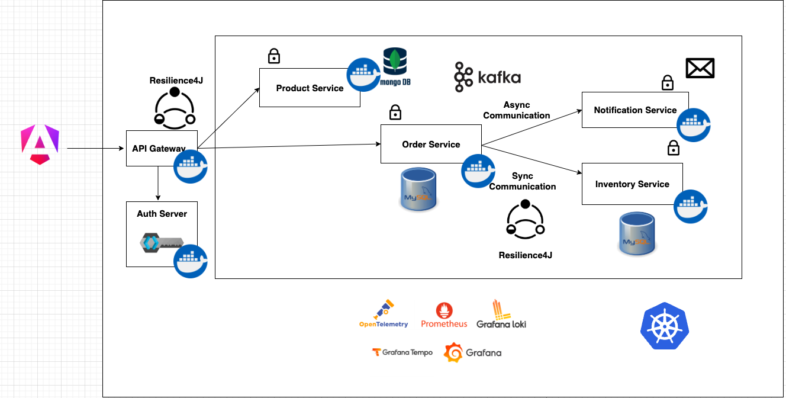

# Spring boot Microservice Project

This project is a Spring boot microservice application for ecommerce. It includes a product service, order service, and user service, each with its own database.

## Getting Started

### Services Overview

- **Product Service**: Manages product information and inventory.
- **Order Service**: Handles customer orders and order history.
- **Inventory Service**: Manages stock levels and product availability.
- **Notification Service**: Sends notifications to users about order status and promotions.
- **API Gateway using Spring Cloud Gateway MVC**: Acts as a single entry point for all services, routing requests to the appropriate service.
- **Shop Frontend using Angular 18**: Provides a user interface for customers to browse products, place orders.

### Tech Stack

The technologies used in this project are:

- Spring Boot
- Angular
- Mongo DB
- MySQL
- Kafka
- Keycloak
- Test Containers with Wiremock
- Grafana Stack (Prometheus, Grafana, Loki and Tempo)
- API Gateway using Spring Cloud Gateway MVC
- Kubernetes

### System architecture



### How to run front-end application

Make sure you have the following installed on your machine:

- Node.js
- NPM
- Angular CLI (Angular 18)

Run the following commands to start the frontend application:

```
cd frontend
npm install
npm run start
```

### How to build the backend services

Run the following command to build and package the backend services into a docker container

```
mvn spring-boot:build-image -DdockerPassword=<your-docker-account-password>
```

The above command will build and package the services into a docker container and push it to your docker hub account.

### How to run the backend services

Make sure you have the following installed on your machine:

- Java 21
- Docker
- Kind Cluster - https://kind.sigs.k8s.io/docs/user/quick-start/#installation

#### Start Kind Cluster

Run the k8s/kind/create-kind-cluster.sh script to create the kind Kubernetes cluster

```
./k8s/kind/create-kind-cluster.sh
```

This will create a kind cluster and pre-load all the required docker images into the cluster, this will save you time downloading the images when you deploy the application.

#### Deploy the infrastructure

Run the k8s/manisfests/infrastructure.yaml file to deploy the infrastructure

```shell
kubectl apply -f k8s/manifests/infrastructure.yaml
```

#### Deploy the services

Run the k8s/manifests/applications.yaml file to deploy the services

```shell
kubectl apply -f k8s/manifests/applications.yaml
```

#### Access the API Gateway

To access the API Gateway, you need to port-forward the gateway service to your local machine

```shell
kubectl port-forward svc/gateway-service 9000:9000
```

#### Access the Keycloak Admin Console

To access the Keycloak admin console, you need to port-forward the keycloak service to your local machine

```shell
kubectl port-forward svc/keycloak 8080:8080
```

#### Access the Grafana Dashboards

To access the Grafana dashboards, you need to port-forward the grafana service to your local machine

```shell
kubectl port-forward svc/grafana 3000:3000
```

#### Backend tips

1. Setup flyway lib for each service

- Choose the correct version of flyway lib that compatible with your database version.
- The directory default location for the migration scripts is `src/main/resources/db/migration`.
- Create migration scripts in the above directory with the naming convention: V + version + two `_` + custom name. Ex: `V1__initial.sql`, `V2__add_column.sql`, etc.
- Make sure to run the migration scripts in the correct order, as flyway will execute them in alphabetical order.

2. Setup testcontainers for each service

- Add the testcontainers dependency to your `pom.xml` file. With three dependencies: `spring-boot-testcontainers`, `testcontainers-junit-jupiter`, and `org.testcontainers` the database specific dependency (e.g., `mysql`, `mongodb`).
- If you don't want the system auto using the lastest version of all image instead of version that you selected, you should remove @Import(TestcontainersConfiguration.class) from the UnitTestClass (Example: `OrderServiceApplicationTests.java`).
- You should use `webEnvironment = SpringBootTest.WebEnvironment.RANDOM_PORT` for @SpringBootTest. With it, the testcontainers will start the container with a random port (which help to preventing overlap port with another application), and you can use the `@LocalServerPort` annotation to get the port number.

## Authors

Name: NMD
Github: [nmd.dev](https://github.com/NMD572)

## Acknowledgments

Inspiration, code snippets, etc.

- [Reference github course](https://github.com/SaiUpadhyayula/spring-boot-3-microservices-course)
